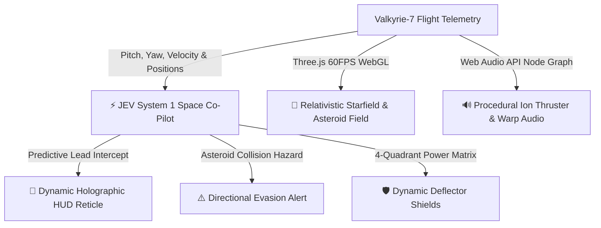

# 🚀 AETHER-VOID // JEV CHRONO-INTERCEPTOR
### Outer Space Sci-Fi Fantasy 3D Flight Combat &bull; JEV System 1 Tactical Co-Pilot (<16ms)

[](https://cyber-duel-jev.vercel.app)
[](https://threejs.org/)
[](https://www.typescriptlang.org/)
[](https://greensock.com/)
[](https://developer.mozilla.org/en-US/docs/Web/API/Web_Audio_API)

> **A high-octane 3D space flight combat simulator set in deep celestial void. Steer the Valkyrie-7 Interceptor through dense asteroid belts and alien drone swarms, assisted by the JEV System 1 Tactical Space Co-Pilot.**

---

## 🌌 The Game Experience

In **Aether-Void**, you pilot the experimental **Valkyrie-7 Chrono-Interceptor** into deep celestial space.
Experience high-speed dogfights, tumbling vertex-deformed asteroids, and volumetric nebula clouds in full **3D WebGL 60FPS**, backed by **zero-asset procedural Web Audio ion thrusters, laser blasts, and warp surges**.

### ⚡ JEV System 1 Tactical Space Co-Pilot
Every frame, **JEV System 1** analyzes high-frequency flight telemetry in **<16ms**:
1. **Predictive Lead Targeting:** Computes first-order target intercept vectors based on enemy drone relative velocities, rendering a dynamic predictive reticle on your holographic HUD.
2. **Sub-20ms Collision Reflex:** Continuously traces asteroid proximity and sounds directional evasive directives (`EVADE STARBOARD / EVADE VENTRAL`) before impact.
3. **Dynamic Shield Modulation:** Distributes deflector shield capacity in real-time across Fore, Aft, Port, and Starboard sectors depending on sublight cruise vs. relativistic warp surges.

---

## 🕹️ Cockpit Flight Controls

| Action | Control (Desktop) | Touch / Mobile | System Mechanics |
| :--- | :--- | :--- | :--- |
| **Steer Flight Vector** | `Mouse Movement` | Touch Drag | Pitch and yaw responsive flight kinematics with dynamic roll banking |
| **Twin Plasma Cannons** | `Space` or `Left Click` | `[FIRE PLASMA]` | Twin converging cyan plasma pulse lasers with collision debris |
| **Relativistic Warp** | `Shift` or `W` | `[WARP SURGE]` | Accelerates to 1.85c; stars stretch into hyperspace streak lines |
| **Deflector Shields** | Automatic | Automatic | Absorbs laser fire & micro-collisions; regenerates in clear space |
| **Audio Toggle** | `M` or Speaker Icon | Speaker Icon | Procedural Web Audio synth (continuous ion hum & laser SFX) |
| **Re-engage Hyperdrive** | `R` or Modal Button | Modal Button | Instant clean respawn on hull breach |

---

## 🧠 System Architecture



---

## 🛠️ Technology Stack

- **3D Graphics:** Three.js (r186) WebGL renderer, ACESFilmic tone mapping, volumetric dodecahedron nebulae, 3,500 procedural stars, vertex-perturbed icosahedron asteroids.
- **Flight HUD:** Next.js 16 (App Router), GSAP 3.15 timeline animations, Lucide icons, Tailwind CSS 4.
- **Tactical Co-Pilot:** JEV System 1 real-time predictive math engine running locally in sub-16ms frames.
- **Procedural Audio:** Web Audio API oscillator nodes, exponential ramp frequency sweeps, bandpass filters, white noise burst buffers.
- **Deployment:** Vercel Edge Network with sub-second global delivery.

---

## 🚀 Quickstart Local Setup

```bash
# Clone the repository
git clone https://github.com/nikhil49023/omniforge.git
cd omniforge

# Install dependencies
bun install

# Start development server
bun dev
```

Open [http://localhost:3000](http://localhost:3000) to enter the cockpit.

---

## 📜 License
MIT License &bull; Built for **Hacktoberfest 2026**
