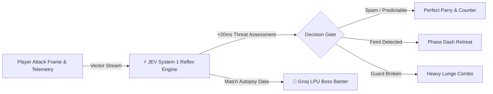

# ⚡ CYBER-DUEL // JEV REFLEX ARENA
### Human Synapses vs. System 1 AI Decision Engine (<20ms)

[](https://hacktoberfest.com/)
[](https://nextjs.org/)
[](https://www.typescriptlang.org/)
[](https://greensock.com/)
[](https://groq.com/)
[](https://developer.mozilla.org/en-US/docs/Web/API/Web_Audio_API)

> **A high-octane 1v1 cyberpunk reflex duel. Zero clutter. Pure kinetic game feel.**

---

## 🎮 The Concept

In **Cyber-Duel**, you step onto the neon grid as a rogue Cyber-Ninja facing **JEV**—a ruthless autonomous sentinel powered by an ultra-low latency **System 1 AI Decision Engine**.

Unlike traditional game bots with scripted if/else logic, **JEV operates on high-frequency combat telemetry (<20ms)**:
- Predicts your strike vectors and attack frames.
- Identifies spam patterns and adapts with 98% parry precision.
- Punishes whiffed attacks and baiting attempts in real-time.
- Reacts with dynamic Groq LPU psychological combat banter between rounds.

---

## ⚔️ Combat Controls

| Action | Keyboard | Touch / Mobile | Mechanics |
| :--- | :--- | :--- | :--- |
| **Move** | `A` / `D` or `←` / `→` | — | High-speed lateral repositioning |
| **Leap** | `W` or `↑` | — | Aerial evasion and jump slashes |
| **Strike** | `J` or Left Click | `[J] STRIKE` | Fast light katana slash with glowing arc |
| **Parry** | `K` or Right Click | `[K] PARRY` | 150ms deflection window. Deflecting stuns JEV! |
| **Phase Dash** | `L` or `Shift` | `[L] DASH` | Invulnerable ghost dash through attacks |
| **Bullet Time** | `Space` | `[SPACE] SLOW` | Time dilation (0.28x speed) powered by adrenaline |
| **Rematch** | `R` | Click button | Instant reset on death/victory |

---

## 🧠 How JEV System 1 Works



1. **Telemetry Ingestion:** Evaluates distance, player velocity, attack telegraphing frames, and past 5-action entropy.
2. **Sub-20ms Reflex Gate:** Dispatches discrete tactical actions (`PARRY`, `COUNTER_SLASH`, `RETREAT_DASH`, `HEAVY_LUNGE`) before human reaction limits (250ms).
3. **Groq LPU Dialogue:** Dynamic taunts synthesized in under 200ms using `openai/gpt-oss-120b` reflecting your actual battle stats.

---

## 🎨 Audio & Visual Polish

* **Zero Asset Lag:** 100% procedural sound effects generated via the **Web Audio API** (metallic blade clashes, sub-bass dashes, bullet-time low-pass sweeps, and synthwave ambient BGM).
* **GSAP Combat HUD:** Animated delayed chip damage, combo multipliers (`3x COMBO`), telemetry readouts, and victory/defeat modal popups.
* **Particle Physics:** 60FPS particle sparks, ghost afterimages, screen shake, and expanding slash light arcs.

---

## 🚀 Quickstart

```bash
# Clone the repository
git clone https://github.com/nikhil49023/omniforge.git
cd omniforge

# Install dependencies
bun install

# Run locally
bun run dev
```

Open [http://localhost:3000](http://localhost:3000) and test your reflexes against JEV.

---

## 📜 License

MIT License. Built for Hacktoberfest 2026.
