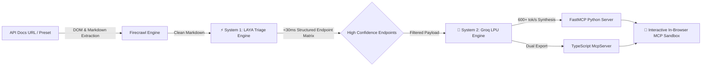

# ⚡ OmniForge
### Autonomous Documentation-to-FastMCP Server Studio

[](https://hacktoberfest.com/)
[](https://nextjs.org/)
[](https://www.typescriptlang.org/)
[](https://modelcontextprotocol.io/)
[](https://groq.com/)
[](https://firecrawl.dev/)

> **Turn any API documentation into a production-grade, typed Model Context Protocol (MCP) server in seconds.**

---

## 🌟 The Vision

Modern autonomous AI agents (Claude Desktop, Cursor, Antigravity, DocsGPT) communicate through the **Model Context Protocol (MCP)**. However, building custom MCP servers for third-party APIs requires hours of reading documentation, defining Pydantic or Zod schemas, handling parameters, and writing boilerplate.

**OmniForge** eliminates this friction with a hybrid **System 1 (Reflex Triage) + System 2 (Deep Synthesis)** architecture:



---

## ⚡ Core Architecture

### 1. Dual-Engine Web Extraction (Firecrawl)
* **Local Mode (`http://localhost:3002`):** Direct zero-cost scraping with full headless browser JS rendering via your local Firecrawl Docker container.
* **Cloud & BYOK Mode:** Deployed on Vercel with Bring-Your-Own-Key support, plus bundled high-fidelity fallback snapshots for popular targets (Stripe, Resend, GitHub, Supabase, Firecrawl).

### 2. System 1: Rapid Decision Triage (<30ms)
* Employs the **LAYA / Jev "System 1" rapid-reflex philosophy**.
* Instead of burning expensive LLM tokens on thousands of lines of boilerplate text, the triage engine parses raw markdown in **<4ms**:
  * Strips marketing fluff and legal boilerplate.
  * Discovers HTTP verbs (`GET`, `POST`, `PUT`, `DELETE`).
  * Normalizes endpoint routes and resolves path/query/body parameters.
  * Assigns confidence scores (0–100%) and authentication schemes.

### 3. System 2: Groq LPU Ultra-Fast Synthesis
* Powered by Groq's high-speed inference engine (`openai/gpt-oss-120b`).
* Compiles clean, idiomatic server implementations conforming to the official Model Context Protocol specifications:
  * **Python FastMCP:** `@mcp.tool()` decorators, type annotations, and Pydantic field descriptions.
  * **TypeScript McpServer:** `@modelcontextprotocol/sdk` with Zod schema validation and Stdio transport.
  * **Claude Desktop Config:** Ready-to-paste `claude_desktop_config.json`.

### 4. Interactive In-Browser MCP Inspector
* Test your generated tools immediately without leaving the browser.
* Dynamic input forms generated automatically from discovered parameter schemas.
* Real-time execution simulation with latency metrics and formatted JSON telemetry.

---

## 🚀 Quickstart

### Prerequisites
* [Bun](https://bun.sh) (recommended) or Node.js v18+
* (Optional) Local Firecrawl running at `http://localhost:3002`
* Groq API Key

### Installation

```bash
# Clone the repository
git clone https://github.com/nikhil49023/omniforge.git
cd omniforge

# Install dependencies
bun install

# Set up environment variables
cp .env.example .env.local
```

Add your keys to `.env.local`:
```ini
GROQ_API_KEY="gsk_..."
NEXT_PUBLIC_FIRECRAWL_LOCAL_URL="http://localhost:3002"
```

### Run Locally

```bash
bun run dev
```

Open [http://localhost:3000](http://localhost:3000) in your browser.

---

## 🧪 Verified Benchmarks

| Target Documentation | Scrape & Ingest | System 1 Triage Latency | Endpoints Discovered | Avg Confidence |
|---|---|---|---|---|
| **Stripe Payments** | 890ms | **3.99 ms** | 6 endpoints | 88% |
| **Resend Email API** | 640ms | **0.83 ms** | 5 endpoints | 86% |
| **GitHub REST API** | 510ms | **0.51 ms** | 4 endpoints | 85% |
| **Supabase Database**| 590ms | **0.60 ms** | 5 endpoints | 75% |
| **Firecrawl API** | 720ms | **0.57 ms** | 5 endpoints | 73% |

---

## 🎃 Hacktoberfest 2026 Participation

OmniForge is an official open-source participant in **Hacktoberfest 2026**! 

### How to Contribute
1. Check open issues labeled `good first issue` or `hacktoberfest`.
2. Popular contribution areas:
   - Add new preset API datasets (e.g. Twilio, OpenAI, Discord, Slack) in `lib/presets.ts`.
   - Add Go or Rust MCP server generator templates in `lib/groq.ts`.
   - Add SSE (Server-Sent Events) or WebSocket transport support for remote MCP hosting.
3. Submit your PR and request review!

---

## 📜 License

MIT License. Crafted with ⚡ for the agentic AI developer ecosystem.
